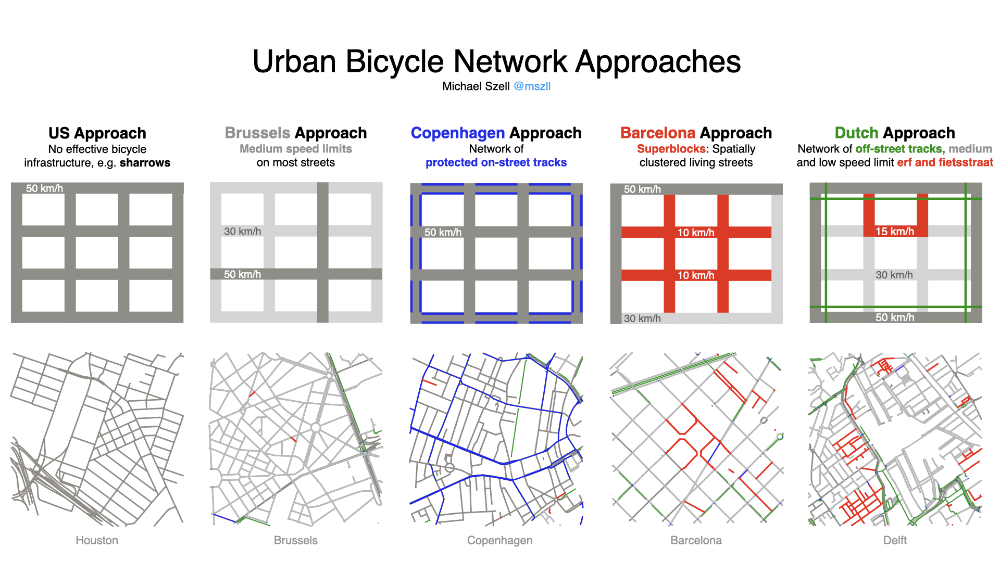

# Taxonomy of Urban Bicycle Network Approaches

## Background
The idea of this visualization is to identify the most distinct environments for cycling arriving from different approaches of urban planning. I intentionally left out any sort of ineffective bicycle infrastructure like unprotected cycle lanes or sharrows, since they do not provide meaningful infrastructure.

The sketches are on purpose simplified caricatures: obviously there is also some protected bicycle infrastructure in the US, obviously there are also low speed limit areas in Copenhagen, obviously there are not many superblocks yet in Barcelona, etc., but the goal is to show the dominant focuses and how these environments feel *in general* from a cycling perspective.

Let me know if I missed something or got anything wrong: michael.szell@gmail.com